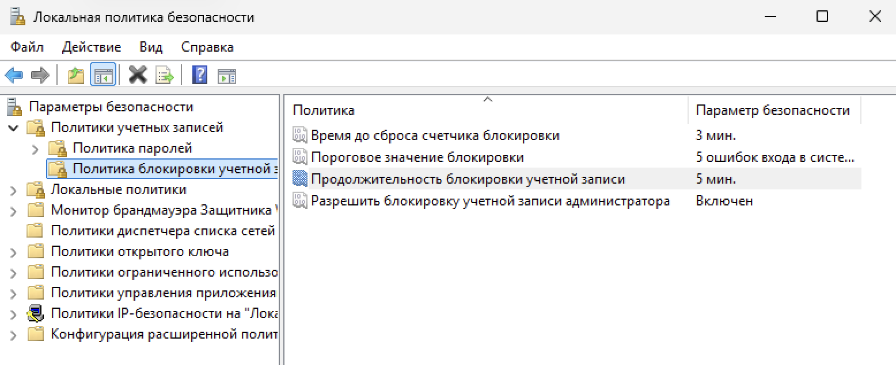

## Лабораторная работа №1

**Задача:** Создать нового пользователя с ограниченными правами доступа. Изменить локальную политику безопасности.

**Пошаговые действия.**

**Шаг 1.** Создание нового пользователя

Управление компьютером -> Служебные программы -> Локальные пользователи и группы -> Пользователи -> (Правой кнопной мыши/двойным касанием тачпада в открывшейся области в середине окна) -> Новый пользователь 

 

Задаем пользователю имя и первоначальный пароль, который будет измменен при первом входе в систему новым пользователем.

**Шаг 2.** Локальная политика безопасности.

**Политика паролей**

Поиск(В панели задач) -> Локальная политика безопасности -> Политики учетных записей -> Политика паролей.

Изменяем максимальный и минимальный срок, и минимальную длину.

**Шаг 2.1.** Локальная политика безопасности.

**Политика блокировки учетной записи.**

Поиск(В панели задач) -> Локальная политика безопасности -> Политики учетных записей -> Политика блокировки учетной записи.

Изменяем количество попыток и продолжительность блокировки.
